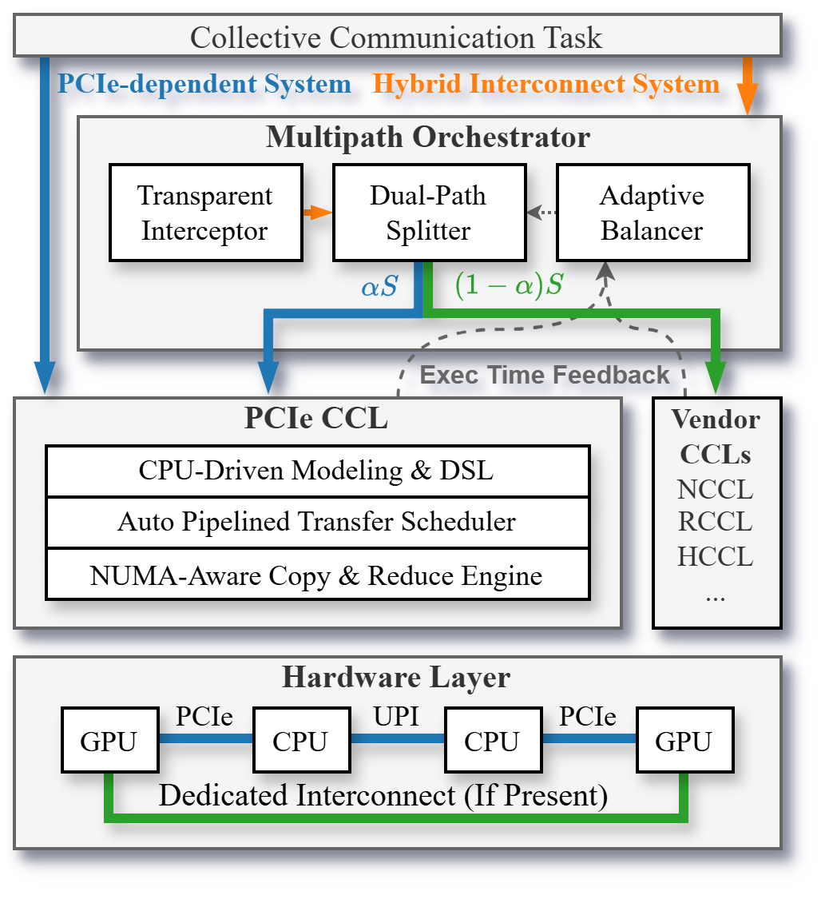

<p align="center">
    <h1 align="center">HyLink</h1>
</p>
<p align="center">
    A two-layer collective communication framework that unlocks underutilized PCIe bandwidth and jointly harnesses dedicated interconnects and the PCIe bus.
</p>

<p align="center">
    
</p>

## Advantages

- 💡 **PCIe CCL** accelerates collective communication on the PCIe path by elevating the CPU to an active routing/computation node, powered by a CPU-driven DSL, an auto-pipelined transfer engine, and SIMD host-side reduction.
- 🔀 **Multipath Orchestrator** splits each collective across the dedicated link and the PCIe path on independent streams with a fork–join model, and a feedback-driven adaptive balancer retunes the splitting ratio at runtime to absorb PCIe interference.
- 🔌 **Transparent and cross-platform** — intercepts existing NCCL / HCCL calls via `LD_PRELOAD` with no application changes, supporting NVIDIA (CUDA) and Huawei Ascend (CANN) on both x86_64 and aarch64.

## Usage

The PCIe-native CCL prototype lives in the `pcie-ccl/` directory, and the dual-path scheduler lives in the `multipath-orchestrator/` directory. Build PCIe CCL first (`cd pcie-ccl && make all`), then build Multipath Orchestrator against it (`cd multipath-orchestrator && PCIECCL_ROOT=../pcie-ccl ./scripts/build.sh -DNCCL_ONLY=ON` or `-DHCCL_ONLY=ON`), and finally run any vendor-CCL benchmark with `AMPCCL_ENABLE=1 LD_PRELOAD=.../libampccl_{nccl,hccl}.so ./your_app`.

## Cite

Your citations are greatly appreciated. 🥰

- ACM Reference
    > Yuezheng Liu, Menghao Zhang, Xuebin Song, Juner Shen, Chunming Hu, and Xudong Liu. 2026. HyLink: Harnessing PCIe and Dedicated Interconnects for Efficient Collective Communication. In Proceedings of the 10th Asia-Pacific Workshop on Networking (APNET '26).
- Bibtex
    ```bibtex
    @inproceedings{hylink2026,
        author    = {Liu, Yuezheng and Zhang, Menghao and Song, Xuebin and Shen, Juner and Hu, Chunming and Liu, Xudong},
        title     = {HyLink: Harnessing PCIe and Dedicated Interconnects for Efficient Collective Communication},
        year      = {2026},
        booktitle = {Proceedings of the 10th Asia-Pacific Workshop on Networking},
        series    = {APNET '26}
    }
    ```
